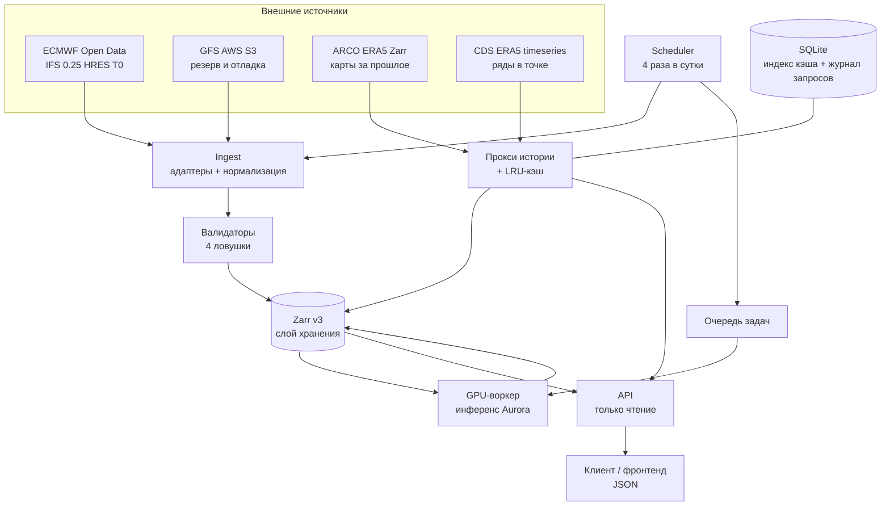

# ARCHITECTURE.md

## Главный принцип

**Прогнозная модель ≠ прогнозная система.** Модель делает три вещи: принимает состояние
атмосферы, шагает по времени, возвращает поля. Система обязана шесть: найти и загрузить
данные · раскодировать форматы · следить за координатами, уровнями, единицами и временем ·
запустить модель · посчитать метрики и физические проверки · сохранить и отдать пользователю.

Пять из шести — инженерия, а не численные методы. Модель у нас готовая. **Это и есть проект.**

Второе производственное ограничение: **точный, но опоздавший прогноз бесполезен.**
Всё проектирование пляшет от крайнего срока доставки, а не от красоты решения.

---

## Схема потоков

Вставить в mermaid.live, если нужна картинка.

---

## Компоненты

| Компонент | Ответственность | Не отвечает за |
|---|---|---|
| **Scheduler** | знает расписание прогонов, ставит задачи в очередь, следит за пропусками | сами данные |
| **Adapter** | один источник, вся его грязь заперта внутри, наружу — только канон | хранение |
| **Validator** | четыре ловушки + физические диапазоны, даёт внятный отказ | исправление данных |
| **Store** | Zarr v3, две раскладки чанков, версии и провенанс | бизнес-логика |
| **Inference worker** | грузит веса Aurora, считает 40 шагов, пишет результат | доступность API |
| **Cache/Proxy** | чанки истории с диска или из origin, LRU, пиннинг | формат ответа |
| **API** | разбор запроса, лимиты, сборка JSON | вычисления и походы в модель |
| **Demo frontend** | численное значение в точке и GIF из сеточных кадров | собственная метеорология и серверное кодирование GIF |

**Единственное направление зависимостей: API → Store/Cache.** API никогда не вызывает модель,
не ходит в ECMWF и не запускает инференс. Если GPU-узел выключен, API продолжает
отдавать последний посчитанный прогноз, помечая его `init_time`. Это прямое следствие того,
что GPU у нас только на время школы.

Тяжёлая выгрузка — исключение только по времени выполнения, не по направлению
данных: `api.exports` читает тот же опубликованный Store в локальном worker-thread,
а durable-состояние держит в `scratch/exports.sqlite3`. Он не импортирует pipeline
и не запускает модель. При горизонтальном запуске SQLite lease сериализует запись
одного `job_id`; артефакт появляется атомарным rename после готовности ZIP.

---

## Пять слоёв хранения

Опорная схема, держать перед глазами при любом решении про данные:

| # | Слой | Смысл | Чем делается |
|---|---|---|---|
| 1 | Сырой неизменяемый архив | исходник никогда не трогаем, к нему всегда можно вернуться | GRIB как скачали |
| 2 | Каталог и происхождение | что где лежит и откуда взялось | `manifest.json`, SQLite |
| 3 | Виртуальный доступ | читаем чужой архив как единый массив, не копируя | ARCO Zarr, прокси |
| 4 | Горячий аналитический слой | материализовано под самые частые запросы | наш Zarr v3 |
| 5 | Слой продуктов | то, что видит пользователь | JSON API |

**API обслуживается только из слоёв 4–5. Никогда из слоя 1.** Нарушение этого правила —
самая типовая причина, по которой сервис отвечает 40 секунд вместо 200 мс.

---

## Бюджет цикла

Цикл запускается 4 раза в сутки. Считаем от момента, когда данные анализа стали доступны:

| Шаг | Целевое время | Жёсткий предел |
|---|---|---|
| Приём и распаковка входных полей | 10 мин | 25 мин |
| Нормализация и валидация | 5 мин | 10 мин |
| Инференс Aurora, 40 шагов | 5 мин | 20 мин |
| Запись в Zarr обеих раскладок | 10 мин | 20 мин |
| Публикация, инвалидация кэша | 1 мин | 5 мин |
| **Итого** | **~31 мин** | **80 мин** |

Если суммарный бюджет превышен — это не «медленно», это отсутствие системы: следующий
прогон начнётся раньше, чем закончится предыдущий. Каждый шаг пишет своё фактическое время
в `manifest.json`, дашборд строится по этим числам.

Замечание про общий возраст данных: анализ 00Z доступен нам примерно в 07:30–08:00 UTC,
плюс ~30 мин цикла — прогноз становится доступен около 08:30 UTC, то есть **через 8.5 часов
после времени, к которому относится начальное состояние**. Это нормально для открытых данных
и должно быть явно отражено в API и в интерфейсе.

---

## Деградация

Что делает система, когда что-то недоступно. Прописать явно, иначе будет тишина и 500.

| Отказ | Поведение |
|---|---|
| ECMWF open data не пришли в срок | ждать до дедлайна, затем откатиться на GFS, пометить `source` в манифесте |
| GPU-узел недоступен | цикл приёма продолжает работать, инференс копится в очереди, API отдаёт предыдущий прогноз |
| ARCO/CDS недоступны | точечные и карточные запросы к истории отдают 503 с `Retry-After`; всё, что в кэше, продолжает работать |
| Диск заполнен выше 95% | приём останавливается, аварийная чистка кэша, алерт |
| Валидатор отверг входные данные | срез не публикуется, предыдущий остаётся актуальным, отказ с указанием поля |
